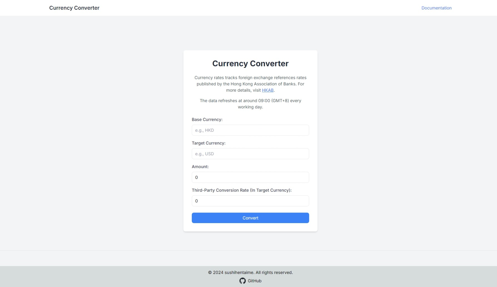

# Currency Converter Application



## Overview

This application provides both an API and a frontend interface for currency conversion. The API serves currency rates, including buying, selling, and mid-market rates, sourced from the Hong Kong Association of Banks. The frontend allows users to perform currency conversions based on these rates and compare them with third-party conversion rates to evaluate potential profit or loss from the transactions. Kindly refer to [Currency Converter](https://currency-converter-3ti.pages.dev/).

## Features

- **API for Currency Rates**: Retrieve buying, selling, and mid-market rates for various currencies.

- **Frontend for Currency Conversion**: A user-friendly interface for converting between currencies based on the latest rates and comparing these rates with third-party rates to assess profit and loss.

## Installation

1. **Clone the repository:**

    ```bash
    git clone https://github.com/sushihentaime/currency-converter.git
    cd currency-converter
    ```

2. **Install dependencies:**

    ```bash
    npm install
    ```

3. **Run the application:**

    ```bash
    npm run dev
    ```

4. **Access the application:**

    Open your browser and go to [http://localhost:3000](http://localhost:3000).

## Contributing

Contributions are welcome! Please open an issue or submit a pull request for any improvements or bug fixes.

## License

This project is licensed under the MIT License.
